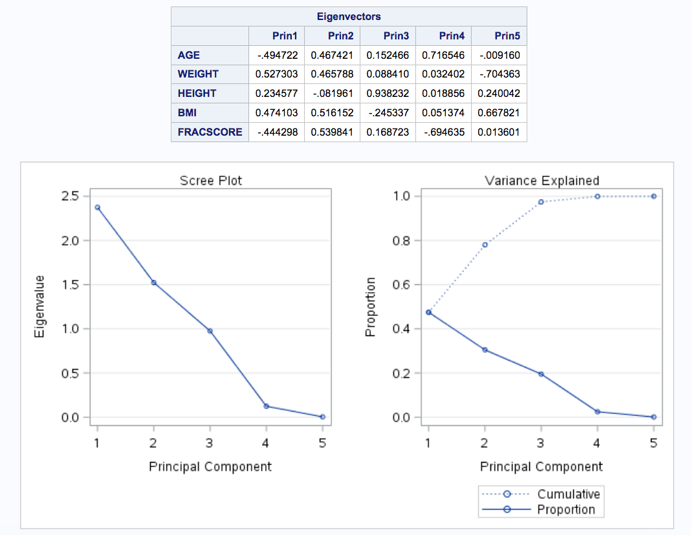
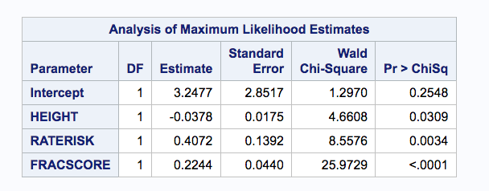
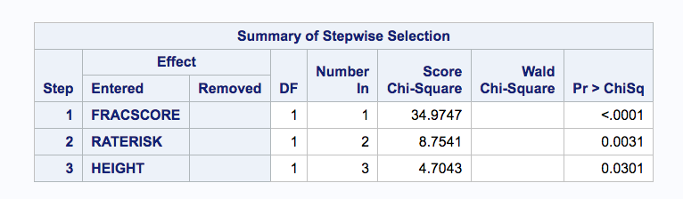
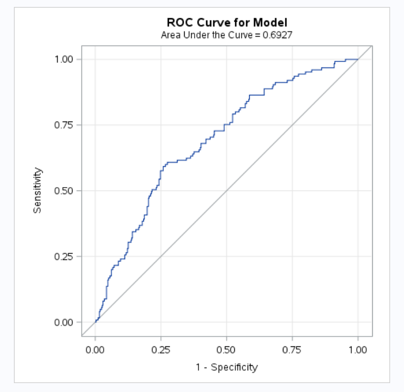
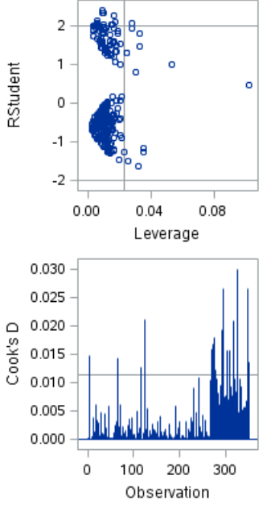
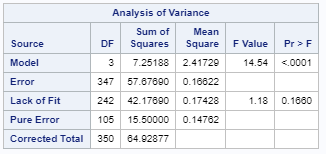
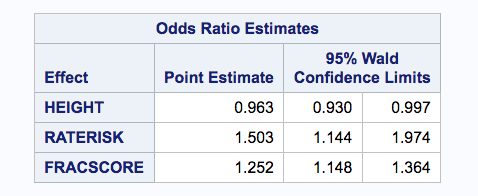

## Introduction

This data analysis report is based on a data set that is collected by the Global Longitudinal Study of Osteoporosis in Women (GLOW). According the official website of the research team (http://www.outcomes-umassmed.org/glow/), the goal of this research was to improve understanding of the risk and prevention of osteoporosis-related fractures among female residents of 10 countries who were 55 years of age and older. GLOW enrolled over 60,000 women through over 700 physicians in 10 countries, and conducted annual follow-up for up to 5 years through annual patient questionnaires. In this study, we explore how to better predict, using the given data, the likelihood that a female with osteoporosis will have a bone fracture given a number of predictors.

## Data Description

The dataset used in this analysis is called GLOW500, which contains 500 observations from six sites in the united states. The target (outcome/response) variable FRACTURE indicates whether the subject had any fracture in the first year of followup. It includes 13 selected potential risk factors for fracture. According to the source of data, given the fact that fracture rate was only 4% these 500 observations are over sampled from 21,000 original observation. 

Description of each field in the data set is as follows:

Explanatory Variables:

```
SUB_ID: Id code for each subject (Categorical)
SITE_ID: Id code for the study site (Categorical)
PHY_ID: Id code for the Physician (Categorical)
PRIORFRAC: Does the subject have history of prior fracture? (1 => Yes, 0 => No) (Bineary)
AGE: Age at enrolment (Numeric)
WEIGHT: Weight at enrollment (Numeric)
HEIGHT: Height at enrollment (Numeric)
BMI: Body mass index (Numeric)
PREMENO: Did the subjet had Menopause before age 45? (1 => Yes, 0 => No) (Bineary)
MOMFRAC: Has subject's mother ever had hip fracture? (1 => Yes, 0 => No) (Bineary)
ARMASSIST: Does the subject need arms to stand form a chare? (1 => Yes, 0 => No) (Bineary)
SMOKE: Is the subject a Smoker? (1 => Yes, 0 => No) (Bineary)
RATERISK: Subject's self-reported risk of fractur (1 => Less than others of the same age, 2 => Same as others of the same age, 3 => Greater than others of the same age) (Categorical)
FRACSCORE: Fracture risk score (Computed based on AGE, WEIGHT, ARMASSIST, SMOKE, MOMFRAC, PRIORFRAC)  (Neumeric)

Response Variable:

FRACTURE: Did subject have any fracture in first year? (1 => Yes, 0 => No) (Bineary)
```

A summary a of dataset that illustrates distribution of each filed is presented below:

```{r, echo=FALSE}
glow500 <- read.csv(file="glow500.csv",head=TRUE,sep=",")
summary(glow500)
```

## Exploratory Analysis

Figure \ref{corr} shows a graphical representation of correlations between all the fields of glow500 datasets. This visualization gives us a very good understanding of how the explanatory variables are related to each other and the response variable. For example, it shows high correlation between PHY_ID and SITE_ID. Also, from this figure we can easily see that BMI is highly correlated to WEIGHT, which is driven by the definition of the BMI. Moreover, it shows that FRACSCORE is highly correlated with AGE, PRIORFRAC, etc., which are used to compute the risk. Correlated variables indicate some level of redundancy in the explanatory variables, and warrant feature selection to prevent overfitting.

Correlation of explanatory variables with the target variable FRACTURE is quite informative. The plot depicts that PRIORFRAC, AGE, ARMASSIST, and MOMFRAC have relatively high positive correlation to the target variable. However, HEIGHT has negative correlation to the target variable.

```{r, echo=FALSE, message=FALSE, fig.cap="\\label{corr} Correlation Matrix"}
# The following code illustrates the correlation matrix of the glov500 dataset
#install.packages("corrplot")
library(corrplot)
glow500_corr <- cor(glow500)
corrplot.mixed(glow500_corr, tl.pos="lt")
```

Performing Principal Component Analysis (PCA), against the numeric explanatory variables also gives us some insight on redundancy and importance of explanatory variables. As the Scree Plot inf figure \ref{ScreePlot} illustrates, only three components can explain over 99% of variance, which indicates some redundancy in these variables that can be justified due to correlation between these variables.





## Addressing Objective 1:

We used step-wise parameter selection method to training a logistic regression model using maximum likelihood method. Parameters of trained model and their p-values are presented in figure \ref{logit_param}



The corresponding regression formula is as follows:

$Logit(P_{Fracture}) = log(Odds Ratio Of Fracture) = log(P_{Fracture}/ (1-P_{Fracture})) = 3.2477 - 0.0378 * HEIGHT + 0.4072 * RATERISK + 0.2244 * FRACSCORE$

In other words:

$P_{Fracture} = Softmax(3.2477 - 0.0378 * HEIGHT + 0.4072 * RATERISK + 0.2244 * FRACSCORE)$


## Model Selection

We found that step-wise parameter selection finds the simplest and most efficient logistic regression model. In next sections we compare this model with other alternatives.

Table \ref{Stepwise} shows how the three variables included in the model are selected and their corresponding p-value at each step:


## Model evaluation:

Model fit statistics for the selected model is shown in figure \ref{model_fit_statistics_sas.png} deviance = 514.085. 


These error metrics are based on the training dataset, so they only show how well the model is able to fit the data. But it does not show how well the model is able to generalize. We evaluated the same model using corss validation and produced the ROC curve in figure \ref{roc_curve_sas_logistic} that shows the specificity and sensitivity of the model and it's capability to generalize. The Area Under the Curve (AUC) is 0.6927, which is reasonabily good and signficicantlty better then arandom model (AUC = 0.5). In future sections we compare this model aginst other competing models.




###		Checking Assumptions




According to the Cook's D, it appears that within the three variables included in the model there are unlikely any values that are too influential (none are greater than 0.5). In addition, while there are no values that have large leverage in the training data and all are clustered close to each other. This makes it simpler to use all three variables without the concern that any one point would negatively affect the predictive value of the model.



Observing the lack of fit, we find that there is not enough evidence to reject the null hypothesis (p > 0.05) of the test that the data fits the model well. It appears that our model, using the three variables, fits the data well and that there are little concerns about outliers affecting the model output.
			
###	Parameter Interpretation

The coeficient of each parameter in the model represents how much the natural logarithm of the odd ration of fracture changes if the parameter increases by one unit, assuming all other parameters remain unchanged. For example when RATERISK increases by 1, the log of odd ratio of frature increases by 0.4072, which means the od ratio increases by $e^0.4072 = 1.503 (this value along with it's 95% confidence interval is also present in the Odds ration Estimate table).

The negative coefficient of HEIGHT is consistent with negative correlation that was illustrated by a pink circle in the correlation matrix in the previous section.

Effect of each variable on the odds ratio (point estimate and 95% confidence interval) is presented in the figure \ref{mylabel}:



	
### Final conclusions from the analyses of Objective 1

In the above analysis we trained a logistic regression that predicts if a subject will have fracture in one year after the last examination. A stepwise parameter selection slected the following parameters as most predictive parameters: HEIGHT, RATERISK, FRACSCORE. The relative low deviance and high AUC indicates the predictive power of the model.

In addition, it appears that the model conforms to the assumptions of a logistic regression. There are no outliers that are too influential on the data and the lack of fit test lacked evidence to reject the fit of the model.


## Addressing Objective 2
In this section we compare the logistic regression model against the following models: Linear Discriminat Analysis (LDA), Quadratic Discrimint Analysis (QDA), Random Forest (RF). To avoid overfiting and proerly evaluate generalization capability of the models we divided the data set into a train (60%) and test dataset (40%). We only used the three explanratory parameters that the stepwise parameter selection selected in the previous section (i.e. HEIGHT, RATERISK, FRACSCORE).

To compare the models, we present confusion matrix, acuracy, and AUC metrics. We also visually compare their ROC curves.

```{r include=FALSE}
library(MASS)       # provides LDA & QDA model functions


glow500 <- read.csv(file="glow500.csv",head=TRUE,sep=",")

set.seed(123)
sample <- sample(c(TRUE, FALSE), nrow(glow500), replace = T, prob = c(0.6,0.4))
train <- glow500[sample, ]
test <- glow500[!sample, ]

```

```{r include=FALSE}
# Train the models

# Train the logistic regression mode
(glm.fit <- glm(FRACTURE ~ RATERISK + FRACSCORE + HEIGHT, data = train))

# Train the lda model
(lda.m1 <- lda(FRACTURE ~ RATERISK + FRACSCORE + HEIGHT, data = train))

# Train theh qda model
(qda.m1 <- qda(FRACTURE ~ RATERISK + FRACSCORE + HEIGHT, data = train))

# Train the random forest model
library(randomForest)
train$FRACTURE_F <- as.factor(train$FRACTURE)
rf.m <- randomForest(FRACTURE_F ~ RATERISK + FRACSCORE + HEIGHT, data=train, maxnodes=3, ntree=100)

```

```{r include=FALSE}
# predictions on test data
test.predicted.glm <- predict(glm.fit, test, type = "response")
test.predicted.lda <- predict(lda.m1, newdata = test)
test.predicted.qda <- predict(qda.m1, newdata = test)
test.predicted.rf <- predict(rf.m, newdata = test, type="response")
```


```{r fig.cap="\\label{confusion} Confusion Matrices"}
# confusion matrix 

# logistic
table(test$FRACTURE, ifelse(test.predicted.glm < 0.5, 0, 1))

# lda
table(test$FRACTURE, test.predicted.lda$class)

# qda
table(test$FRACTURE, test.predicted.qda$class)

# random forset
table(test$FRACTURE,  test.predicted.rf)

```

```{r fig.cap="\\label{accuracy} Accuracy Rates"}
# accuracy rate

# logistic
mean(ifelse(test.predicted.glm > 0.5, 1 , 0) == test$FRACTURE)
# lda
mean(test.predicted.lda$class == test$FRACTURE)
# qda
mean(test.predicted.qda$class == test$FRACTURE)
# random forest
mean(test.predicted.rf == test$FRACTURE)
```


```{r, echo=FALSE, message=FALSE, fig.cap="\\label{roc} ROC curves"}
# ROC curves
library(ROCR)
library(dplyr)

library(randomForest)
train$FRACTURE <- as.factor(train$FRACTURE)
rf.m <- randomForest(FRACTURE ~ RATERISK + FRACSCORE + HEIGHT, data=train, maxnodes=5, ntree= 1000)
test.predicted.rf <- predict(rf.m, newdata = test, type="response")


logistic <- prediction(test.predicted.glm, test$FRACTURE) %>%
  performance(measure = "tpr", x.measure = "fpr")

lda <- prediction(test.predicted.lda$posterior[,2], test$FRACTURE) %>%
  performance(measure = "tpr", x.measure = "fpr")

qda <- prediction(test.predicted.qda$posterior[,2], test$FRACTURE) %>%
  performance(measure = "tpr", x.measure = "fpr")

test.predicted.rf.prob <- predict(rf.m, newdata = test, type="prob")
rf <- prediction(test.predicted.rf.prob[,2], test$FRACTURE) %>%
  performance(measure = "tpr", x.measure = "fpr")

plot(logistic, col = "red")
plot(lda, add = TRUE, col = "blue")
plot(qda, add = TRUE, col = "green")
plot(rf, add = TRUE, col = "yellow")

```

```{r fig.cap="\\label{auc} AUCs"}
# Logistic regression AUC
prediction(test.predicted.glm, test$FRACTURE) %>%
  performance(measure = "auc") %>%
  .@y.values

# LDA AUC
prediction(test.predicted.lda$posterior[,2], test$FRACTURE) %>%
  performance(measure = "auc") %>%
  .@y.values

# QDA AUC
prediction(test.predicted.qda$posterior[,2], test$FRACTURE) %>%
  performance(measure = "auc") %>%
  .@y.values

# RandomForest AUC
prediction(test.predicted.rf.prob[,2], test$FRACTURE) %>%
  performance(measure = "auc") %>%
  .@y.values

```
```{r, echo=FALSE,  fig.cap="\\label{lda} LDA model discriminative power"}
plot(lda.m1)
```

## Conclusion/Discussion Required
In this project we evaluated four different types of classification models for predicting probability of fracture using Glow500 dataset. First we use stepwise loggistic regression to find select parameters and then we trained four models using logistic regression, LDA, QDA, and random forest. The models were trained on only 60% of data and the rest of data was used for model evaluation. We looked at confusion matrix, accuracy rates, ROC curves and AUC to compare the models. Logistic regression and LDA have very similar performance characteristics and outpeformed QDA and random forest. 

It appears that, using a logistic regression or LDA model, the likelihood of a woman having fractures can be predicted with some accuracy. However, even the most accurate models makes it apparent that the predictors used may be inadequate to predict with high certainty whether fractures will occur. However, since predictions can be helpful to prevent injuries, a positive error could still be benefitial if an intervention/preventative treatment is inexpensive.

## Appendix Required

R Codes:

```{r, echo=FALSE, eval=FALSE}
glow500 <- read.csv(file="glow500.csv",head=TRUE,sep=",")
summary(glow500)
```

```{r, echo=FALSE, message=FALSE, fig.cap="\\label{corr} Correlation Matrix", eval=FALSE}
# The following code illustrates the correlation matrix of the glov500 dataset
#install.packages("corrplot")
library(corrplot)
glow500_corr <- cor(glow500)
corrplot.mixed(glow500_corr, tl.pos="lt")
```

```{r include=FALSE, eval=FALSE}
library(MASS)       # provides LDA & QDA model functions


glow500 <- read.csv(file="glow500.csv",head=TRUE,sep=",")

set.seed(123)
sample <- sample(c(TRUE, FALSE), nrow(glow500), replace = T, prob = c(0.6,0.4))
train <- glow500[sample, ]
test <- glow500[!sample, ]

```

```{r include=FALSE, eval=FALSE}
# Train the models

# Train the logistic regression mode
(glm.fit <- glm(FRACTURE ~ RATERISK + FRACSCORE + HEIGHT, data = train))

# Train the lda model
(lda.m1 <- lda(FRACTURE ~ RATERISK + FRACSCORE + HEIGHT, data = train))

# Train theh qda model
(qda.m1 <- qda(FRACTURE ~ RATERISK + FRACSCORE + HEIGHT, data = train))

# Train the random forest model
library(randomForest)
train$FRACTURE_F <- as.factor(train$FRACTURE)
rf.m <- randomForest(FRACTURE_F ~ RATERISK + FRACSCORE + HEIGHT, data=train, maxnodes=3, ntree=100)

```

```{r include=FALSE, eval=FALSE}
# predictions on test data
test.predicted.glm <- predict(glm.fit, test, type = "response")
test.predicted.lda <- predict(lda.m1, newdata = test)
test.predicted.qda <- predict(qda.m1, newdata = test)
test.predicted.rf <- predict(rf.m, newdata = test, type="response")
```


```{r fig.cap="\\label{confusion} Confusion Matrices", eval=FALSE}
# confusion matrix 

# logistic
table(test$FRACTURE, ifelse(test.predicted.glm < 0.5, 0, 1))

# lda
table(test$FRACTURE, test.predicted.lda$class)

# qda
table(test$FRACTURE, test.predicted.qda$class)

# random forset
table(test$FRACTURE,  test.predicted.rf)

```

```{r fig.cap="\\label{accuracy} Accuracy Rates", eval=FALSE}
# accuracy rate

# logistic
mean(ifelse(test.predicted.glm > 0.5, 1 , 0) == test$FRACTURE)
# lda
mean(test.predicted.lda$class == test$FRACTURE)
# qda
mean(test.predicted.qda$class == test$FRACTURE)
# random forest
mean(test.predicted.rf == test$FRACTURE)
```


```{r, echo=FALSE, message=FALSE, fig.cap="\\label{roc} ROC curves", eval=FALSE}
# ROC curves
library(ROCR)
library(dplyr)

library(randomForest)
train$FRACTURE <- as.factor(train$FRACTURE)
rf.m <- randomForest(FRACTURE ~ RATERISK + FRACSCORE + HEIGHT, data=train, maxnodes=5, ntree= 1000)
test.predicted.rf <- predict(rf.m, newdata = test, type="response")


logistic <- prediction(test.predicted.glm, test$FRACTURE) %>%
  performance(measure = "tpr", x.measure = "fpr")

lda <- prediction(test.predicted.lda$posterior[,2], test$FRACTURE) %>%
  performance(measure = "tpr", x.measure = "fpr")

qda <- prediction(test.predicted.qda$posterior[,2], test$FRACTURE) %>%
  performance(measure = "tpr", x.measure = "fpr")

test.predicted.rf.prob <- predict(rf.m, newdata = test, type="prob")
rf <- prediction(test.predicted.rf.prob[,2], test$FRACTURE) %>%
  performance(measure = "tpr", x.measure = "fpr")

plot(logistic, col = "red")
plot(lda, add = TRUE, col = "blue")
plot(qda, add = TRUE, col = "green")
plot(rf, add = TRUE, col = "yellow")

```

```{r fig.cap="\\label{auc} AUCs", eval=FALSE}
# Logistic regression AUC
prediction(test.predicted.glm, test$FRACTURE) %>%
  performance(measure = "auc") %>%
  .@y.values

# LDA AUC
prediction(test.predicted.lda$posterior[,2], test$FRACTURE) %>%
  performance(measure = "auc") %>%
  .@y.values

# QDA AUC
prediction(test.predicted.qda$posterior[,2], test$FRACTURE) %>%
  performance(measure = "auc") %>%
  .@y.values

# RandomForest AUC
prediction(test.predicted.rf.prob[,2], test$FRACTURE) %>%
  performance(measure = "auc") %>%
  .@y.values

```

```{r, echo=FALSE, fig.cap="\\label{lda} LDA model discriminative power", eval=FALSE}
plot(lda.m1)
```

SAS Codes:


```
LIBNAME MYSASLIB '/home/szarandioon0/';
DATA GLOW500_ORIG;
INFILE '/home/szarandioon0/statistics2/Project2/glow500.csv' DLM = ',' FIRSTOBS = 2;
INPUT SUB_ID SITE_ID PHY_ID	PRIORFRAC AGE WEIGHT HEIGHT BMI PREMENO MOMFRAC ARMASSIST SMOKE RATERISK FRACSCORE FRACTURE;
RUN;

DATA GLOW500(DROP = SUB_ID); 
SET GLOW500_ORIG;
RUN;

proc factor data=GLOW500 simple corr;
run;

ods graphics on;
proc princomp data=GLOW500 plots(ncomp=3)=all n=5;
run;

title 'Stepwise Regression on Global Longitudinal Study of Osteoporosis in Women (GLOW) Dataset';
proc logistic data=GLOW500 outest=betas covout;
model FRACTURE(event='1')=SITE_ID PHY_ID PRIORFRAC AGE WEIGHT HEIGHT BMI PREMENO	MOMFRAC	ARMASSIST	SMOKE	RATERISK	FRACSCORE
                   / selection=stepwise;
output out=pred p=phat lower=lcl upper=ucl predprob=(individual crossvalidate);
run;

proc logistic data=GLOW500 rocoptions(crossvalidate) plots(only)=roc;
model FRACTURE(event="1") = RATERISK FRACSCORE HEIGHT;
run;

data train test;
set GLOW500;
if rand('uniform') <= 0.3
then output test;
else output train;
run;

ods graphics on;
proc logistic data=train;
model FRACTURE(event="1") = RATERISK FRACSCORE HEIGHT / outroc=troc;
score data=test out=valpred outroc=vroc;
roc; roccontrast;
run;

proc logistic data=train plots(only)=roc;
model FRACTURE(event="1") = RATERISK FRACSCORE HEIGHT;
run;

proc logistic data=train rocoptions(crossvalidate) plots(only)=roc;
model FRACTURE(event="1") = RATERISK FRACSCORE HEIGHT;
run;

proc discrim data=train testdata=test canonical;
class FRACTURE;
var SITE_ID	PHY_ID PRIORFRAC AGE WEIGHT HEIGHT BMI PREMENO MOMFRAC ARMASSIST SMOKE RATERISK FRACSCORE;
run;

proc hpforest data=train;
target FRACTURE/level=nominal;
input PRIORFRAC PREMENO MOMFRAC ARMASSIST SMOKE/level=nominal;
input SITE_ID PHY_ID AGE WEIGHT HEIGHT BMI RATERISK FRACSCORE/level=interval;
run;

/*
 * Checking assumptions
 */
proc reg data = train;
  model FRACTURE = FRACSCORE RATERISK HEIGHT;
  output out = t student=res cookd = cookd h = lev;
run;

```

## References
* [Wiley Series In Probability And Statistics, Section 1.6.3](https://ia800206.us.archive.org/7/items/WileySeriesInProbabilityAndStatisticsDavidW.HosmerStanleyLemeshowRodneyX.Sturdiv/(Wiley%20Series%20in%20Probability%20and%20Statistics)%20David%20W.%20Hosmer,%20Stanley%20Lemeshow,%20Rodney%20X.%20Sturdivant%20(auth.),%20Walter%20A.%20Shewhart,%20Samuel%20S.%20Wilks%20(eds.)-Applied%20Logistic%20Regression-Wiley%20(2013).pdf)
* http://uc-r.github.io/discriminant_analysis

